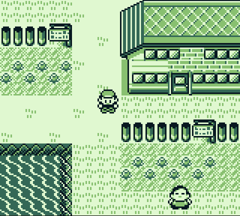
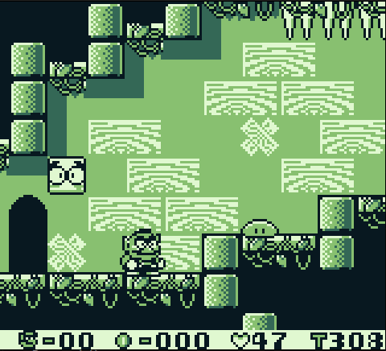
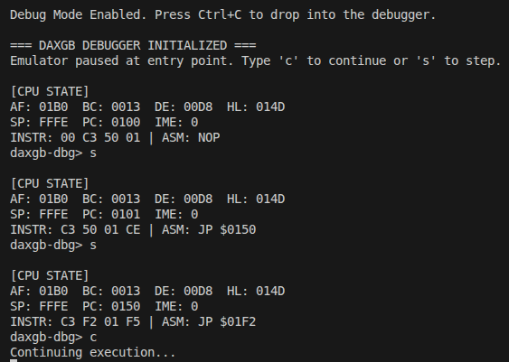

# daxgb

A minimalist, high-performance Game Boy emulator written in C.

Designed for systems-level educational purposes and retro-hardware experimentation.

---

## Screenshots

### Pokémon Red


### Wario Land


### Debugger


---

## Features

- Full support for the DMG-01 (original Game Boy) architecture
- Passes 100% of Blargg's CPU instruction test suite
- Pixel-perfect rendering with support for:
  - Background layer
  - Window layer
  - Sprite layer
- Multi-channel audio generation:
  - Square Wave channels
  - Wave channel
  - Noise channel
  - Integrated DC-offset high-pass filtering
- Save state serialization and deserialization ("Time Travel")
- Built-in terminal debugger
- Instruction disassembly
- FPS monitoring

---

## Known Limitations

- Audio may experience minor timing-related artifacts during heavy hardware sweep operations
- MBC3 Real-Time Clock (RTC) support is currently a stub
- Serial Port / Link Cable support is stubbed for commercial games
  - ASCII telemetry routing is fully functional for test ROMs

---

## Quick Start

### Requirements

- GCC
- Make
- SDL2 Development Libraries (`libsdl2-dev`)

### Build

```bash
make
```

### Run

```bash
./daxgb_emulator [-d | -t] <path_to_rom.gb>
```

---

## Command Line Options

| Option | Description |
|----------|-------------|
| `-d` | Launch emulator in interactive debugger mode |
| `--debug` | Same as `-d` |
| `-t` | Launch headlessly at uncapped speed for automated testing |
| `--test` | Same as `-t` |

---

## Testing

Run the automated CPU test suite:

```bash
./run_tests.sh
```

> **Note:** Requires Blargg's instruction test ROMs to be placed inside the `tests/` directory.

---

## Controls

D-Pad: Arrow Keys

A: Z

B: X

Start: Enter

Select: Backspace

Toggle FPS Display: F

Save State: O

Load State: L

---

## Debugger Controls

Pause Execution / Enter Debugger: Ctrl+C

Step One Instruction: S

Print Registers & Current Disassembly: R